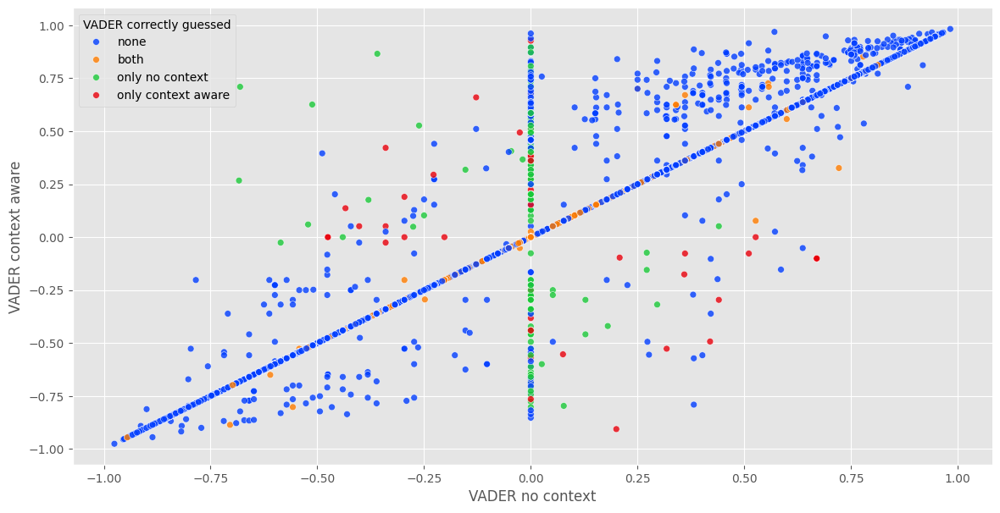

# Twitter Sentiment Analysis (NLP)

## Project Overview
This project explores the impact of including hashtag words as context in sentiment analysis of tweets. It employs a traditional "bag of words" approach to analyze tweet sentiment, both with and without incorporating words from hashtags. The results are then compared with a state-of-the-art BERT-based model to evaluate the effectiveness of context inclusion.

TL;DR [jump to results](#analysis-and-results)

## Data
The dataset used is gender-classifier-DFE-791531 from Kaggle, which includes various tweets and information relative to the authors.

## Data Processing
- **Extraction of Hashtags**: Words within hashtags are split using a probabilistic concatenated word splitter.
- **Text Cleaning**: Standard preprocessing steps like tokenization, stop-word removal, lowercasing, hyperlink removal, hashtag removal and emoji removal.

## Metohds
- Bag of Words: The baseline approach where each tweet is represented by a list of non-stop-word words.
- Enhanced Bag of Words with Hashtag Context: Words from hashtags are included in the Bag of Words representation to provide additional context.
- Comparison with BERT: A BERT-based model is used to analyze the same tweets, serving as a benchmark for evaluating the BoW methods

## Optimizations
Since this notebook was run on only CPU, the following techniques were adopted to speed up the process:
- **Batch processing**
- **Disable gradient calculation**: Avoiding unnecessary gradient computations during the inference phase to speed up processing.

## Key Techniques
- **Soft-max**: Converting raw model outputs into normalized probabilities.
- **Probabilistic concatenated word split**: Utilized to split concatenated words in hashtags into meaningful words
- **Grouping**: Necessary to avoid dispersion on timeseries data.
- **Visualization**: Creating scatter plots to depict relationships between various metrics.


## Analysis and Results
Contrary to the hypothesis, including hashtag words as context in the BoW representation actually resulted in lower accuracy. The traditional BoW method, which did not incorporate hashtag words, performed better in classifying tweet sentiments.



| Approach            | Accuracy |
|---------------------|----------|
| VADER context aware | 34.70%   |
| VADER no context    | 35.73%   |

The results indicate that the addition of hashtag words as context in the BoW approach does not enhance sentiment analysis accuracy and may, in fact, reduce it. Therefore, the hypothesis that using words in hashtags as context would improve tweet sentiment analysis was not verified.

## Additional Notes
- Emoji removal was necessary in the Bag of Words approach because their meaning is purely contextual. 

## Dependencies
It is very strongly recommended to run the notebook on [Google Colab](https://colab.research.google.com/).
```
!pip install wordninja
```
Additional packages are specified within the notebook.

## Contributing
This project is currently closed to contributions. However, you are welcome to fork the repository and build upon it for your own experiments or projects.

## Acknowledgements
- Dataset [gender-classifier-DFE-791531](https://www.kaggle.com/datasets/crowdflower/twitter-user-gender-classification/data) provided by [Kaggle](https://www.kaggle.com)
- Tweet classification model [BERTweet](https://huggingface.co/docs/transformers/model_doc/bertweet) provided by [Hugging Face](https://huggingface.co)
- Probabilistic concatenated word splitter [WordNinja](https://github.com/keredson/wordninja)

## Liked my work?
Reach out to me on [LinkedIn](https://www.linkedin.com/in/ahmed-maruf-15684a212/)

Thank you for reading! Consider leaving a star if you liked the project ☆\*: .｡. o(≧▽≦)o .｡.:\*☆
